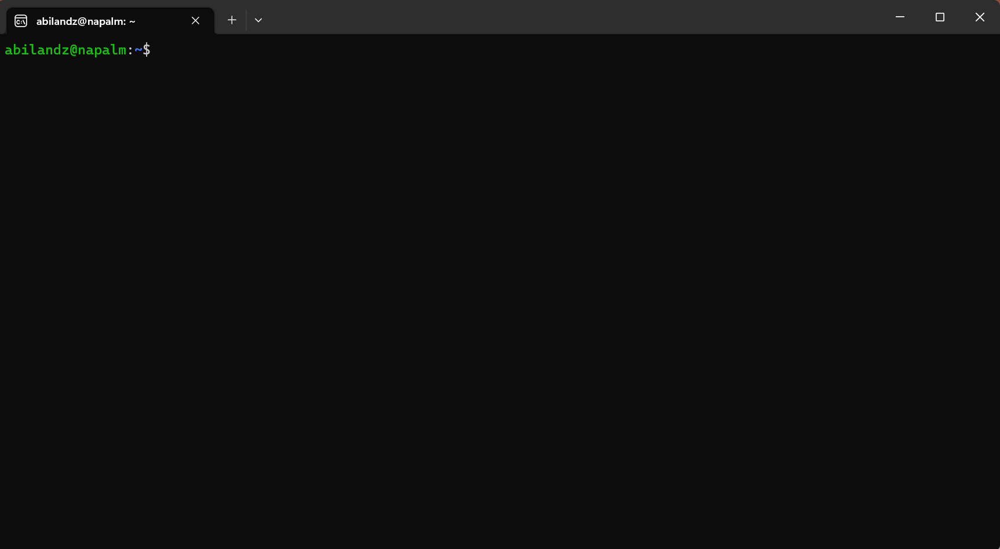

# Shell environment: commands and variables

**Last update**: 20260904-1

### Table of Contents

1. [Introduction](Lecture_2.md#introduction)
2. [Shell environment](Lecture_2.md#environment)
   * [Commands](Lecture_2.md#commands)
   * [Variables](Lecture_2.md#variables)

### 1. Introduction <a href="#introduction" id="introduction"></a>

When it comes to the operating systems nowadays, in high-energy experimental physics we mostly rely on **Linux**. That being said, as an experimental physicist you are sooner or later faced with the following situation: You have turned on your computer and launched the terminal...



... and what now??

You can start clicking with the mouse over the terminal, but quickly you will realize that this leads you nowhere. Next, you can start typing and pressing 'Enter', but especially if you do it for the first time most likely whatever you have typed in the terminal will produce only the error messages. Still, that is something, as it clearly means that there is some secret/magic command interpreter which is trying to respond to your command input, as soon as you have typed something in the terminal and pressed 'Enter'.

What is that secret built-in command interpreter available in the terminal? This lecture is all about shedding light on its existence...

Loosely speaking, **shell** is the generic name of any program that user employs to type commands in the terminal (a.k.a. text window). Example **shells**:

* sh
* bash
* zsh
* ksh
* csh
* fish
* PowerShell (developed by Microsoft!)

To get the list of **shells** available on your computer, type in the terminal:

```bash
cat /etc/shells 
```

The output of that command could look like:

```bash
/etc/shells: valid login shells
/bin/sh
/bin/dash
/bin/bash
/bin/rbash
/usr/bin/screen
/usr/bin/fish
```

How to select your favorite **shell**? It is simple, just type its name in the terminal and press 'Enter'! E.g. if you want to use **Bash** as your working **shell**, just type in the terminal:

```bash
bash
```

and press 'Enter' &mdash; now you are in the **Bash** wonderland! Since that is by far the most popular **shell** nowadays, this lecture will focus exclusively on its concepts, syntax and commands. But no worries, at least conceptually, a lot of subjects covered in this lecture apply also to other **shells**! The difference between **shells** is mostly in the syntax, but in essence, they all aim to provide the same functionalities.

In this lecture we will cover only the **Bash** essentials, i.e. we will make you going, but how far you want to go eventually, it depends on your personal determination and time investment.

Important remark: **Bash** (or any other **shell** as a matter of fact) is first and foremost a command interpreter (i.e. interface for executing commands). Even though it offers a lot of functionalities typical for programming languages, its direct use as a programming language is only a distant second goal. In practice, within **Bash** code we can use directly and easily an executable of any full-fledged programming language (e.g. **C**, **C++**, **Mathematica**, etc.). But none of these languages can be used directly and easily as a command interpreter in the terminal.

Traditionally, the first program people write when learning a new programming language is the so-called _"Hello World"_ example. Let's keep up with this tradition and type in the terminal:

```bash
echo "Hello World" 
```

This will output in the terminal:

```bash
Hello World
```

i.e. **Bash** has echoed back the text "Hello World" which was typed in the terminal as an _argument_ to **echo** command. Let's move on!

### 2. Shell environment: commands and variables <a href="#environment" id="environment"></a>

When you open a terminal, your local environment is defined via some command names and predefined variables, which can be used directly in the current terminal session. Before going more into the details of how to modify the **shell** environment, let us see first how commands and variables are used in general.

#### Commands <a href="#commands" id="commands"></a>

We have already seen how one built-in **Bash** command works, namely **echo**. In the same spirit, we can use in the terminal any other **Linux** command, not necessarily the built-in **Bash** command.

**Example:** What is the current time? Just type in the terminal **date** and press 'Enter'

```bash
date
```

This will output in the terminal something like:

```bash
Mon Apr 20 14:49:10 CEST 2020
```

This is the default formatting of **date** command. Now use the command **date** with flag (or option) **-u**, in order to modify its default behavior:

```bash
date -u
```

This will output in the terminal the different text stream:

```bash
Mon Apr 20 12:49:12 UTC 2020
```

After passing a certain flag, we have instructed command **date** to change its default behavior. In the above example, the flag **-u** caused the command **date** to report time in Coordinated Universal Time format (UTC), instead of Central European Summer Time (CEST) time zone (which is the default for our location).

As another example, we have already seen how we can use **cat** command to view the content of file when inquiring which **shells** are available on the computer. We can pass to command **cat** as arguments more files to read in one go, i.e. we can execute the same command in one go on multiple arguments:

```bash
cat /etc/shells /etc/hostname
```

The output of that command now could look like:

```bash
/etc/shells: valid login shells
/bin/sh
/bin/dash
/bin/bash
/bin/rbash
/usr/bin/screen
/usr/bin/fish
transfer.ktas.ph.tum.de
```

Note the new entry in the last line, which is the content of file `/etc/hostname` .

We can, of course, combine options and arguments when invoking a command:

```bash
$ cat -n /etc/shells 
     1	# /etc/shells: valid login shells
     2	/bin/sh
     3	/bin/dash
     4	/bin/bash
     5	/bin/rbash
     6	/usr/bin/screen
     7	/usr/bin/fish
```

The flag **-n** causes command **cat** to enumerate all lines in its printout.

In general, all **Bash** and **Linux** commands are conceptually implemented in the same way &mdash; let us now discuss what is conceptually always the same in their implementation and usage.

Generically, for most cases of interest, we are executing commands in the terminal in the following way:

```linux
<command-name> <option(s)> <argument(s)>
```

This is the right moment to stress the importance and profound meaning of empty character: Empty character is the default input field separator (**IFS**) in the world of **Linux**. If you misuse the empty character, a lot of input in the terminal will be completely incomprehensible to **Bash**, and to **Linux** commands in general. In the above generic example, empty character separates the three items, which conceptually have a completely different meaning. As the very first step, after you have typed the input in the terminal and pressed 'Enter', the **Bash** splits your input into tokens that are separated (by default, and in a bit simplified picture) with one or more empty characters. Then, it checks whether the very first token is a known **Linux** command, **Bash** built-in command, etc.

The command input in **Bash** is terminated either by a new line or by a semi-colon `;` character. In practice, it is equivalent to write:

```bash
echo "Hello World"
date
```

or

```bash
echo "Hello World";date
```

or

```bash
echo "Hello World" ;   date
```

Let us now scrutinize the above generic syntax for command execution term by term:

* `<command-name>` : Whatever you type first in the terminal, i.e. before the next empty character is being encountered on terminal input, **Bash** is trying to interpret as some **Linux** command, **Bash** built-in command, **Bash** keyword, etc. In general, _command-name_ stands for one of the following:
  * **Linux** command (i.e. system-wide executable or binary) &mdash; example: **cat**
  * **Bash** built-in command &mdash; example: **echo**
  * **Bash** keyword &mdash; example: **for**
  * alias
  * function
  * script
* `<option(s)>` : Options (or flags) are used to modify the default behaviour of command. Options are indicated either with:
  * **-** (single dash) followed by single character(s), or
  * **--** (two consecutive dashes) followed by more descriptive explanation about what needs to be modified in the default behaviour of command.

For instance, the frequently used flags **-a** and **--all** are synonyms, in a sense that they modify the default behavior of command in exactly the same way. The first version is easier to type, but the meaning of the second one is easier to memorize. Example for **date** command:

```bash
$ date -u
Mon Apr 20 12:49:12 UTC 2020
$ date --utc
Mon Apr 20 12:49:12 UTC 2020
```

The output in both cases above is the same, because flags **-u** and **--utc** are synonyms when used for **date** command.

But how do we know that for command **date** flags **-u** and **--utc** are available, and how do we know in which way they will modify the default behavior of command? All such options for each command are documented in so-called _man pages_. Whenever you develop a new command, it is also essential that you develop its documentation, otherwise nobody will be able to use your command. For built-in **Bash** commands, keywords, etc., the documentation is retrieved simply with:

```bash
help <command-name>
```

For **Linux** commands, we can use the command **man** (shortcut for _manual_) to retrieve the documentation. The syntax is fairly simple:

```bash
man <command-name>
```

In order to exit the _man pages_, press 'q'. You can scroll down the _man page_ line-by-line by pressing 'Enter', or page-by-page by pressing 'Spacebar'. The colorful online version of _man pages_ is available at this [link](https://manpages.org) .

As you can see, even simple commands, like **date**, can have extensive documentation and a lot of options. It is clearly impossible to memorize all options for all commands, therefore usage of **help** and **man** commands is needed almost on a daily basis.

After we have covered command names and options, we close this section with the last item: command arguments.

* `<argument(s)>` : This is simple, sometimes you want your command to be executed on the specified argument, or in one go on multiple arguments. For instance, we can make an empty file in the current working directory by using the **touch** command:

```bash
touch file_1.log
```

But we could create plenty of empty files with **touch** command in one go, not one-by-one, e.g.

```bash
touch file_1.log file_2.log file_3.log file_4.log
```

Important remark: Since the empty character is an input field separator, never use it as a part of a file or directory name! In such a context, always replace it with underscore `_` or any other character which does not have special meaning. For instance:

```bash
touch file 1.log
```

would literally create two empty files, the first one named `file`, and the second one named `1.log` . If you apply **touch** command on an already existing file, only the timestamp of that file will be updated to the current time, its content remains exactly the same.

In order to see or to list all files and subdirectories in the current working directory, use **ls** command, i.e.

```bash
ls -al
```

For the meaning of options **-a** and **-l** check the _man pages_ of **ls** command. As a side remark, we indicate that options may or may not themselves require specific arguments. Options which do not require specific arguments, can be grouped together, i.e. **ls -a -l** is exactly the same as a shorthand **ls -al**.

In the same spirit, we can create multiple directories in one go, with **mkdir** command, e.g.

```bash
mkdir subdir_1 subdir_2 subdir_3
```

will make three new subdirectories in your current working directory (check again its content by executing **ls -al**).

We have been using so far only the already existing **Bash** or **Linux** commands. The simplest way to create your own command, with a rather limited functionality and flexibility but nevertheless quite convenient, is to use **Bash** built-in feature **alias**. If you are bored to type something lengthy again and again in the terminal, you can introduce shortcut for it, by using **alias**. For instance, you can abbreviate this lengthy input

```bash
echo "Hello, welcome to the crash course on Linux OS and Bash shell"
```

into the simple new command **Welcome** by creating an alias for it:

```bash
alias Welcome='echo "Hello, welcome to the crash course on Linux OS and Bash shell"'
```

Now the following new command in the terminal works as well:

```bash
Welcome
```

Press 'Enter' and the output in the terminal shall be:

```bash
Hello, welcome to the crash course on Linux OS and Bash shell
```

Quite frequently, aliases are used in the following context: If you want to connect from your desktop machine to some other computer, e.g. _lxplus_ at CERN, you need to type in the terminal something lengthy like:

```bash
ssh -Y abilandz@lxplus.cern.ch
```

But do you really want to type that again and again each time you want to connect to _lxplus_ at CERN? You can save a lot of typing, by introducing the alias for it:

```bash
alias lx='ssh -Y abilandz@lxplus.cern.ch'
```

Here basically you have defined the abbreviation (or alias, or shortcut) for lengthy command input, and you have named it **lx**. Now it suffices only to type in the terminal

```bash
lx
```

and you will be connecting to _lxplus_ at CERN with much less effort and time investment.

Another typical use case of aliases is to prevent command name typos. For instance, if you realize that too frequently instead of **ls** you have a typo **sl** when writing in the terminal, which does nothing except producing an error message, you can simply define the new alias for it:

```bash
alias sl=ls
```

After this definition, **sl** is literally a synonym for **ls** command.

If you have forgotten all aliases you have introduced in the current terminal session, just type in the terminal

```bash
alias
```

and all alias definitions will show up. If you want to see what is the definition of the concrete alias you have introduced, use

```bash
alias <alias-name>
```

The alias definition can be removed with **Bash** built-in command **unalias**, e.g.:

```bash
unalias <alias-name> 
```

If you want to clean up all aliases in the current terminal, use:

```bash
unalias -a
```

where also for the command **unalias** the option **-a** stands for 'all'.

Aliases are definitely a nice feature, but do not overuse them, because:

* By default, aliases are available only in the terminal in which you have defined them. But this can be easily circumvented by modifying the special configuration file `.bashrc` and/or an additional customary file `.bash_aliases` &mdash; to be clarified later in this section;
* When you move to another computer your personal aliases are clearly not available there by default;
*   Aliases can overwrite the name of the existing **Linux** or **Bash** command, and aliases will have the higher precedence in execution. In this case, you can execute the overwritten command by prepending backslash `\` to its name, i.e. with `\commandName`. For instance:

    ```bash
    $ alias ls="echo 44"
    $ ls
    44
    $ \ls
    ... standard list of files and directories ...
    ```

    In this context, we have _escaped_ the alias definition of 'ls' with the special symbol backslash `\` &mdash; this escaping mechanism is elaborated more in detail and in a wider context later;
* Aliases cannot process programmatically options or arguments, like regular commands (or **Bash** functions, as we will see later). In fact, any alias implementation can be reimplemented as a **Bash** function in a more general and flexible way. However, the function implementation requires more coding;
* Do not use alias definitions in the shell scripts, that's considered to be both bad coding and bad design practice.

In summary, aliases are literally shortcuts for lengthy commands or any other lengthy terminal input, and aliases are meant to be used directly in the terminal merely to save time on typing. Whatever you have defined an alias to stand for, **Bash** with simply inline or replace the alias name in the terminal with its definition, and then execute &mdash; nothing more nor less than that!

#### Variables <a href="#variables" id="variables"></a>

Just as any other programming language, **Bash** also supports a notion of _variable_. How to define variable in **Bash**? For instance, we want to use the variable named `Var` and initialize it with the value of 44. Simply type in the terminal:

```bash
Var=44
```

While this appears to be the most trivial thing you could do, even at this simple level we can encounter some problems, which can very nicely illustrate some of the general design philosophy used in **Bash** and **Linux**. Most importantly, since an _empty character_ is the default input field separator, it would be completely wrong to type any of the following:

```bash
Var =44 # WRONG!!
Var= 44 # WRONG!!
Var = 44 # WRONG!!
```

In the 1st and 3rd cases above, we get the following error message `Var: command not found`, since **Bash** was trying to interpret the first token in the input, `Var` in this case, as a command name. Since command named `Var` was not found, **Bash** writes this error message in the terminal.

In the 2nd case, the error message is slightly different, namely `44: command not found`, and it requires a separate explanation. In general, if we define a variable and execute some command in the same line like in the 2nd case above, i.e. without using `;` to separate them, the content of that variable is visible only during the execution of that particular command. The generic syntax is:

```bash
Var=value command # content of 'Var' is seen only in 'command' during its execution
```

That means that the command input `Var= 44` **Bash** will interpret as follows: Set the content of `Var` to nothing (this also removes the previous content if it existed), and use that new content only during the execution of command named `44`. Since such command does not exist, we get the error message `44: command not found` for this particular case.

Therefore, when introducing and initializing a new variable in **Bash**, make sure there are no empty characters on both sides of the _assignment operator_ **=** .

As a side remark, from the above three lines, we can also see how to make a comment in **Bash** &mdash; simply use the special character **#** (hash symbol) to start your comment. Once this character is used on the particular line, any text after it is being ignored by **Bash**. You can not terminate the comment within a given line in which you have used **#** to start the comment. Therefore, you can terminate the commented text only by starting to write in the new line.

**Example:** Writing a comment in **Bash**.

```bash
$ echo "Hi there" # this text is some comment which Bash ignores
Hi there
```

Once defined, how to use (or reference) the content stored in a variable? In order to reference the content of a variable, we use the special symbol **$** to achieve that, e.g.

```bash
Var=44
echo $Var
```

Also this syntax will do the job:

```bash
Var=44
echo ${Var}
```

In both cases the printout in the terminal is the same, namely:

```bash
44
```

So what is the difference between the two syntaxes above? The latter is less error-prone (as it clearly delineates with curly braces the variable name from the rest of the code!) and more powerful, as it enables a lot of built-in functionalities for string manipulations programmatically within **Bash**.

As an example, this will produce the desired result only in the latter case:

```bash
Var=44
echo test${Var}test
```

The output is:

```bash
test44test
```

If the first and shorter syntax is used instead, then `Vartest` would be interpreted as a variable name, and since such variable was not defined, it would evaluate to the null string.

```bash
Var=44
echo test$Vartest
```

The output is:

```bash
test
```

Few final additional remarks on variables in **Bash**:

* They are untyped (i.e. you do not need to specify at declaration whether variables are integers, strings, etc.). By default, all **Bash** variables are strings, but if they contain only digits and if you pass them to some operator which takes as argument(s) only integers, then **Bash** will interpret such variable as an integer;
* By convention, for the names of built-in **Bash** variables only capital characters are used (e.g. **BASHPID**, **BASH\_SOURCE**, etc.), while for command names we use all low-case characters. For user's variables, use some intermediate case, like `Var` or `someVariable`, to ease the code readability and to avoid potential conflict with the existing built-in **Bash** variables. Variable name starts with a letter or underscore, and may contain any number of following letters, digits and underscores. Common mistakes: Variable name can not start with a digit and it can not contain a dash `-`;
* The lifetime of a variable is by default limited to the terminal session in which you have defined it. But you can make its existence persistent in any new terminal you open (i.e. in your _environment_) by adding its definition to the very special `.bashrc` configuration file;
* The scope of a variable is by default limited to the current process in which it was declared. But you can make its existence persistent in any new process started from the current process (i.e. in any _child_ process), by using the shell's built-in command **export** at its declaration, for instance, `export Var=44` . This way, variable `Var` is persistent in all new processes started from your current terminal session, in which variable was both declared and exported. Using an alternative terminology, with **export** you have created a global variable;
* To delete variable, use built-in command **unset**, e.g. `unset Var` . Variables which do not exist are assumed to be null, i.e. equal to the empty strings. Therefore, even if variable named `Var` was not declared, this code snippet does not produce an error: `echo $Var` (simply, nothing is printed);
* It is possible to store in the variable the output of some command, and then manipulate this output programmatically (more on this later!);
* It is possible to store in the variable the content of an external file;
* There are some built-in variables always set to some values, e.g. **HOME**, **SHELL**, **PATH**, etc. These special variables are the essential part of your **shell** environment, and if they are not set correctly, everything in your current terminal session can start falling apart.
