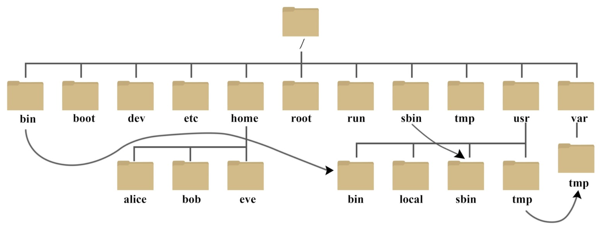

# Linux file system and core utilities

**Last update**: 20260904-1

### Table of Contents

1. [**Linux** file system](#file_system)
2. [Core utilities](#core_utilities)


### 1. **Linux** file system <a href="#file_system" id="file_system"></a>

We have already seen how you can make your own files (e.g. with **touch**, **cat** or **nano**), and your own directories (with **mkdir**). The organization of files and directories in **Linux** is not arbitrary, and it follows the common and widely accepted structure named [_Filesystem Hierarchy Standard (FHS)_](https://refspecs.linuxfoundation.org/fhs.shtml). The top directory is the so-called _root_ directory and is denoted by `/` (slash). You can enter it and see its content by executing the following code snippet in the terminal:

```bash
cd /
ls
```

The output could look like:

```bash
bin  boot  dev  etc  home  lib  media  opt  proc  root  run  sbin  sys  tmp  usr  var
```

All files and directories on your computer are in one of these subdirectories. Depending on which Linux distribution you are using, the details might differ &mdash; you can programmatically inspect which Linux distribution is installed on your computer with the following command:

```bash
$ cat /etc/os-release 
NAME="Ubuntu"
VERSION="20.04.4 LTS (Focal Fossa)"
ID=ubuntu
ID_LIKE=debian
PRETTY_NAME="Ubuntu 20.04.4 LTS"
VERSION_ID="20.04"
HOME_URL="https://www.ubuntu.com/"
SUPPORT_URL="https://help.ubuntu.com/"
BUG_REPORT_URL="https://bugs.launchpad.net/ubuntu/"
PRIVACY_POLICY_URL="https://www.ubuntu.com/legal/terms-and-policies/privacy-policy"
VERSION_CODENAME=focal
UBUNTU_CODENAME=focal

```

Schematically, the **Linux** file system structure can be represented with the following diagram:



The **Bash** built-in command **cd** ('change directory') is used to move from the current working directory to some other directory. It accepts only one argument, which is interpreted either as an _absolute path_ to the new directory (if the argument starts with `/`), or as a _relative path_ to the new directory (relative to your current working directory). If you use **cd** without any argument, the argument is defaulted to the home directory. Due to their special meanings, the only characters that cannot be part of a directory name are `/` and the null byte `\0`.

If you get confused where you are at the moment in the **Linux** file system (i.e. where is your current working directory in the overall file system hierarchy), you can always get that information either from **Bash** built-in command **pwd** ('print working directory'):

```bash
pwd
```

or by referencing the content of environment variable **PWD**, which is always set to the absolute path of your current working directory:

```bash
echo $PWD
```

Both versions return the same answer in all cases of practical interest. However, and as a general rule of thumb, it is always much more efficient to get information directly from the environment variable like **PWD**, than to retrieve and store in a variable the same information by executing the command, via the so-called _command substitution operator_ `$( ... )` (more on this later).

The most important directories in the **Linux** file system structure are:

* `/bin` : essential binaries needed for system functioning at any run level
* `/usr/bin` : binaries used by all locally logged in users
* `/usr/sbin` : binaries used only with superuser (root) privileges
* `/dev` : location of special or device files
* `/etc` : system-wide configuration files
* `/home` : holds user-specific accounts, personal area for each user
* `/proc` : kernel and process information
* `/tmp` : temporary files

We have already used **Linux** commands **date** and **touch**. But to which physical executables (binaries), stored somewhere in the file system, these two commands correspond to? For all cases of practical interest, you can figure that out simply by using the command **which**:

```bash
$ which date
/bin/date
```

```bash
$ which touch
/usr/bin/touch
```

It is completely equivalent to execute in the terminal the command name, e.g. **date**, or the full absolute path to the corresponding executable. Therefore,

```bash
$ date
Mon Apr 27 16:12:06 CEST 2020
```

is the same as:

```bash
$ /bin/date
Mon Apr 27 16:12:06 CEST 2020
```

It would be very tedious and impractical if each time we would like to use some command, it would be necessary to type in the terminal the absolute path to its executable sitting somewhere in the **Linux** file system, both in terms of typing and in terms of memorizing the exact locations. This is precisely where **Bash** (or any other **shell**) is extremely helpful &mdash; **shell** finds the correct executable in the file system for us, after we have typed only the short command name in the terminal, and executes it. Clearly, something is happening here behind the scene: How does **shell** know which physical executable in the file system is linked with the short command name you have typed in the terminal? Hypothetically, we could also have another version of **date** command sitting somewhere else in the file system, e.g. in the directory `/usr/bin/date`. Then there is an ambiguity, since after we have typed in the terminal **date**, it is not clear whether we want `/bin/date` or `/usr/bin/date` to be executed.

This is resolved with a very important environment variable **PATH**. To see its current content, simply type:

```bash
echo $PATH
```

The output could look like this:

```bash
/home/abilandz/bin:/usr/local/sbin:/usr/local/bin:/usr/sbin:/usr/bin:/sbin:/bin
```

This output looks messy, but in fact it has a well-defined structure which is easy to decipher. In the above output, we can recognize absolute paths to a few directories, which are separated in this context with the field separator `:` (colon). The directories specified in the environment variable **PATH** are extremely important, because only inside them **Bash** will be searching for a corresponding executable, after you have typed the short command name in the terminal. Literally, the command **date** works because the directory **/bin**, where its corresponding executable `/bin/date` sits, was added to the content of **PATH** variable. The order of directories in **PATH** variable matters &mdash; when **Bash** finds your executable in some directory specified in **PATH**, it will stop searching in the other directories specified in **PATH**. The priority of the search is from left to right. Therefore, if you have two executables in the file system for the same command name, e.g. `/bin/date` and `/usr/bin/date`, and if the content of **PATH** is as in the example above, after you have typed in the terminal **date**, **Bash** would try first to execute `/usr/bin/date` and not `/bin/date`, because `/usr/bin` is specified before `/bin` in the **PATH** variable. However, since there is no **date** executable in `/usr/bin`, **Bash** continues the search for it in `/bin`, finally finds it there, and then executes `/bin/date` .

By manipulating the ordering of directories in **PATH** variable, you can also have your own version of any **Linux** command &mdash; just place the directory with your own executables at the beginning of **PATH** variable, and then those directories will be searched first by **Bash**. For instance, you can have your own executable for **date** in your local directory for binaries (e.g. in `/home/abilandz/bin`). Then, you need to redefine **PATH** in such a way that it has your personal directory with higher priority, when compared to standard system-wide directories for command executables (like `/bin`, `/usr/bin`, etc.). This is achieved with the following standard code snippet:

```bash
PATH="/home/abilandz/bin:${PATH}"
```

With this syntax, directory with your personal executables `/home/abilandz/bin` is prepended to the current content of **PATH**, and therefore your executables will have a higher priority in the **Bash** search.

For the lower priority of your executables, use an alternative standard code snippet:

```bash
PATH="${PATH}:/home/abilandz/bin"
```

In this example, you have appended the directory with your executables to what is already set in **PATH** &mdash; this way you indicate that you want to use your own version of some standard system-wide **Linux** command only if its executable is not found by **Bash**. As always, if you want to make such definitions permanent in any new terminal you open, add the above redefinitions of **PATH** into `~/.bashrc` file. In case you want the redefinition of **PATH** to be persistent in all new processes you start from a terminal, use in addition the command **export** at the first redefinition of **PATH** variable.

From the above explanation, it is clear that if you unset **PATH** variable, all commands will stop working when you type them in the terminal, because **Bash** does not know where to search for the corresponding executables.

We finalize the explanation of **PATH** variable with the following concluding remarks:

* The search for the corresponding executable, after you have typed the short command name in the terminal, is optimized in the following ways:
  * Not all the files in the specified directories in **PATH** are considered during the search &mdash; only the files which have _execute permission_ (`x`) are taken into account (more on this in a moment!);
  *   The recently used commands are _hashed_ in the table &mdash; this table is then looked up first by **Bash** after you type the command name in the terminal. To see the current content of the hash table, just type **Bash** built-in command **hash** in the terminal:

      ```bash
      hash
      ```

      The output could look like:

      ```bash
      hits    command
         4    /usr/bin/which
         5    /usr/bin/git
         1    /bin/date
         2    /bin/cat
         6    /bin/ls
      ```

      Clearly, the hash mechanism adds a lot to the efficiency of commands' usage in **Linux**. Each time you login for the first time on computer the hash table is empty. Each terminal session keeps its own hash table.
*   The **PATH** search can be skipped by the user. In particular, when the command name contains the `/` (slash) character, not necessarily at the beginning of the name, **Bash** will not perform the search for the corresponding executable &mdash; underlying assumption is that you have now yourself specified the path in the file system, either absolute or relative, to the corresponding executable. In this case, **Bash** tries to execute that command name on the spot. This explains the standard syntax to run the command whose executable is in your current directory:

    ```bash
    ./someCommand
    ```

    In this context, the dot `.` is a shortcut syntax for the absolute path to the current working directory (the analogous shorthand notation for the parent directory is `..`). With the above syntax, even if the command **someCommand** with a different implementation exists in some directory stored in **PATH**, it will never be searched for and executed, because there is `/` in the above command input.


### 2. Core utilities <a href="#core_utilities" id="core_utilities"></a>


Some frequently used **Linux** commands to work within the file system are:

*   **cp** : copy file(s)

    ```bash
    cp file1 file2 # copying and renaming a file
    cp file1 file2 ... someDirectory # copying two or more files into someDirectory 
                                     # the names of original files are preserved
    ```

    Files and directories in the arguments of **cp** can be specified either with the absolute or the relative paths. This is true in general for all commands which take files and directories as arguments.
*   **cp -r** : copy directory and preserve its subdirectory structure

    ```bash
    cp -r directory1 directory2 # this will copy the first directory into 
                                # a new subdirectory of the second directory
    ```
*   **rm** : delete file(s)

    ```bash
    rm file1 file2 ... # delete the specifed files
    ```

    Use **rm** with great care, because after you deleted the file, there is no easy way back!
*   **rm -rf** : delete one or more directories

    ```bash
    rm -rf dir1 dir2 ... # delete the specified directories
    ```

    Flag **-r** ('recursive') is needed to indicate that you want to delete all subdirectories recursively, **-f** ('force') is needed to avoid the prompt message which would ask you for the deleting confirmation of each file separately. Use **rm -rf** with the greatest possible care, because after you have deleted the directory, there is no easy way to get back any of the files that was in that directory!
*   **mv** : move or rename files or directories

    ```bash
    mv someFile someDir/   # moving a file into new directory
    mv file1 someDir/file2 # content of 'file1' overwrites 'file2', and 'file1' is deleted
    mv file1 file2         # effectively renaming: 'file2' becomes 'file1' 
                           # (they are in the same directory!)
    ```

    The command **mv** uses the same syntax for directories (no additional flags are needed).

    ```bash
    mv dir1 dir2      # if 'dir2' exists, 'dir1' becomes the subdirectory of 'dir2' 
                      # if 'dir2' doesn't exist, 'dir1' is renamed into 'dir2'
    mv dir1 dir2 ... dirN # if 'dirN' exists, 'dir1', 'dir2', ..., become subdirectories of 'dirN' 
                          # if 'dirN' doesn't exist, syntax error   
    ```
*   **du -sh** ('disk usage') : Estimate the disk space used by files and directories. For directories, the flag **-s** prints the summary size for all nested subdirectories. The flag **-h** prints the size in a human-readable format.

    ```bash
    $ du -sh ${HOME} # prints how much disk space your home directory is taking
    967M
    $ du -h --max-depth=1 ${HOME} # the size of directory, and differentially
                                  # of its subdirectories
    $ du -h --max-depth=2 ${HOME} # the size of directory, differentially of its
                                  # subdirectories and all sub-subdirectories
    $ du -h file1.txt file2.txt # prints size of two specified files
    20K  	file1.txt
    192K	file2.txt
    ```
*   **df -h** ('disk free') : get the used disk space of all disks in a human-readable format (the flag **-h**).

    ```bash
    $ df -h # get the status of all disks
    file system      Size  Used Avail Use% Mounted on
    /dev/sda1        1.8T  1.6T  132G  93% /
    ```
*   **stat** : display the detailed metadata of file or directory.

    ```bash
    $ stat Lecture_2.md # just specify the abs. or rel. path to file as an argument
      File: Lecture_2.md
      Size: 97805           Blocks: 384        IO Block: 4096   regular file
    Device: 2h/2d   Inode: 12947848928707821  Links: 1
    Access: (0666/-rw-rw-rw-)  Uid: ( 1000/abilandz)   Gid: ( 1000/abilandz)
    Access: 2020-04-15 21:05:26.002857000 +0200
    Modify: 2020-04-28 11:44:53.454187100 +0200
    Change: 2020-04-28 11:45:14.515681300 +0200
     Birth: -
    ```

    Later we will learn how to parse through and extract programmatically from any command output (or from any physical file) only the information we need. Specifically for the **stat** command, if you want to get only the size of the file in bytes, use directly:

    ```bash
    $ stat -c %s Lecture_2.md
    97805
    ```

    For the size of a directory, use instead **du -sh** as explained above.

As you can see from the above output of **stat**, the example file `Lecture_2.md` is characterized by three timestamps: **Access**, **Modify** and **Change**. These three timestamps are an important part of file metadata, which we cover next.
