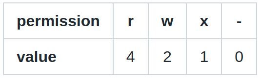
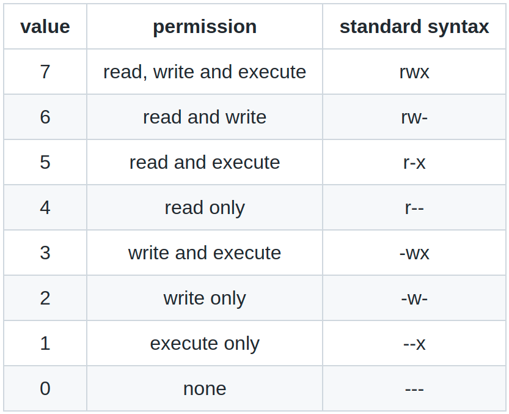

# File metadata and permissions

**Last update**: 20260904-1

### Table of Contents

1. [File metadata](#file_metadata)
2. [Permissions](#permissions)

### 1. File metadata <a href="#file_metadata" id="file_metadata"></a>

File metadata is any file-related information besides its content. From the user's perspective, the most important file metadata are _timestamps_, _ownership_ and _permissions_.

The meaning of three timestamps is as follows:

* **Access (atime)** : last time a file was accessed (opened) and read without any modification
* **Modify (mtime)** : last time a file was modified (i.e. its content has been edited)
* **Change (ctime)** : last time a file's metadata was changed (e.g. permissions)

These three timestamps are not an overkill, in fact, they enable a lot of very powerful features when searching for specific files or directories in the file system. For instance, by using them, it is possible to list names of all files modified within the last day, to delete all files which were not accessed for more than 1 year, etc.

Next, each file or directory in **Linux** has three distinct levels of ownership:

* **User (u)** : the person who created the file
* **Group (g)** : the wider group to which the person who created the file belongs to
* **Other (o)** : anybody else

File ownership becomes extremely handy in combination with file permissions, when it is very simple to set common access rights for any group of other users.

Finally, each file in **Linux** has three distinct levels of permissions (or access rights):

* **Read (r)** : file can be read
* **Write (w)** : file can be written to (i.e. edited)
* **Execute (x)** : file is executable (i.e. binary, program)

For instance, when you execute

```bash
ls -al someFile
```

you can get the following example output:

```bash
-rw-rw-rw- 1 abilandz alice 97805 Apr 28 12:23 someFile
```

It is very important to understand all entries in this output, and how to modify or set some of them. Reading from left to right:

* **Column #1:**
  * the very first character is the file type: `-` is an ordinary file, `d` is a directory, `l` is a soft link, etc.
  * characters 2, 3 and 4 are fields for `r`, `w` or `x` permissions for the user (i.e. for you)
  * characters 5, 6 and 7 are fields for `r`, `w` or `x` permissions for the group (i.e. wider group of people where your account belongs to)
  * characters 8, 9 and 10 are fields for `r`, `w` or `x` permissions for anybody else
* **Column #2:** For a file, it is always 1. For a directory, it is the number of immediate subdirectories in it, plus its parent directory and itself. Therefore, for directories, this number is always greater than or equal to 2. It is equal to 2 for an empty directory, and for a directory that contains only files (i.e. there are no subdirectories). It is greater than 2 for a directory if there is at least one subdirectory in that directory.
* **Column #3:** The user who owns the file ('abilandz' in this case).
* **Column #4:** The group of users to which the file belongs (ALICE experiment at CERN in this case).
* **Column #5:** The size of the file in bytes (for directories, it has another meaning, it is NOT the size of the directory!).

The meaning of the remaining columns is trivial.


### 2. Permissions <a href="#permissions" id="permissions"></a>

File permissions are changed with the **Linux** command **chmod** ('change mode'). This is best illustrated with a few concrete examples:

```bash
chmod o+r someFile.txt
```

After the above command was executed, others (`o`) can (`+`) read (`r`) your file `someFile.txt`. Whatever was set for `w` and `x` flags for others, it remains intact. A slightly different notation:

```bash
chmod o=r someFile.txt
```

would ensure that for others, only `r` is set, while `w` and `x` flags are forced to `-`. In this example:

```bash
chmod go-w someFile.txt
```

group members to which your account belongs to (`g`) and all others (`o`) can not (`-`) modify or write (`w`) to your file `someFile.txt`. Therefore, after this simple command execution, only you can edit this file!

With this syntax:

```bash
chmod u+x someFile.txt
```

the file `someFile.txt` is declared to be an executable and only you as a user (`u`) can (`+`) execute (`x`) it.

Remember that only the files which are executables are taken into account by **Bash** when searching through the content of directories in **PATH** variable. Therefore, when making your own **Linux** command, two formal aspects must be always met:

1. the directory containing your executable must be included in the content of **PATH** variable;
2. your executable must have `x` permission.

Next example:

```bash
chmod ugo+rwx someFile.txt
```

Now everybody (you as a user (`u`), group members (`g`) and others (`o`)), can read (`r`), modify or write (`w`) to, or execute your file (`x`). For directories, you can change permissions in one go for all files in all subdirectories, by specifying the flag `-R` ('recursive'), i.e. by using schematically:

```bash
chmod -R some-options-to-change-permissions someDirectory
```

Note that it makes a perfect sense to use `x` permission also for directories, because we can then add recursively in one go `x` permission to all files in that directory.

Finally, we clarify that the setting for each permission can be represented alternatively by a numerical value. The rule is established with the following simple table:



When these values are added together, the sum is used to set specific permissions.

For example, if you want to set only 'read' and 'write' permissions, you need to use a value 6, because from the above table, it follows immediately: 4 ('read') + 2 ('write') = 6. If you want to remove all of 'read', 'write' and 'execute' permissions, you need to specify 0.

For convenience, all possibilities are documented in the table:



**Example:** Make a new file with default permissions, then remove all permissions, and set the permission pattern to `-rwx--xr--` , by using both syntaxes described above. With the first syntax, we would have:

```bash
touch file.log # make a new file
# the default permission pattern is: -rw-rw-rw-
chmod ugo-rwx file.log # strip off all permissions
# pattern is now: ----------
chmod u+rwx,g+x,o+r file.log # set new requested permissions
# the final pattern is: -rwx--xr--
```

With the alternative syntax, we proceed as follows:

```bash
touch file.log # make a new file
# the default permission pattern is: -rw-rw-rw-
chmod 000 file.log # strip off all permissions
# pattern is now: ----------
chmod 714 file.log
# the final pattern is: -rwx--xr--
```

It practice, it is not needed to remove old permissions and only then to set the new ones &mdash; it was done here that way only for the sake of this exercise, but the old permissions can be directly overwritten.

**Example:** Does command **cp** copy also the permissions of original file into a new file?

```bash
# make a new file with default permissions:
$ touch file1.txt 

# check the permisions:
$ ls -la file1.txt
-rw-rw-r-- 1 abilandz abilandz 0 Mai 14 14:19 file1.txt

# change the permisions:
$ chmod o+w file1.txt

# copy the original file into new file:
$ cp file1.txt file2.txt

# check the permissions of both files:
$ ls -al file*
-rw-rw-rw- 1 abilandz abilandz 0 Mai 14 14:19 file1.txt
-rw-rw-r-- 1 abilandz abilandz 0 Mai 14 14:22 file2.txt

# copy the original file into new file using option '-a':
$ cp -a file1.txt file3.txt

# check the permissions of all files:
$ ls -al file*
-rw-rw-rw- 1 abilandz abilandz 0 Mai 14 14:19 file1.txt
-rw-rw-r-- 1 abilandz abilandz 0 Mai 14 14:22 file2.txt
-rw-rw-rw- 1 abilandz abilandz 0 Mai 14 14:19 file3.txt
```

As we can see above, the new file _file2.txt_ was created with default permissions if **cp** was used without any options. Permissions were correctly copied over into the new file _file3.txt_ only if **cp -a** was used (in this context, the flag **-a** means 'preserve all'). The same thing happens when on a shared computer we copy a file from the home directory of another user into our home directory. As a side remark, we mention that the default permissions for files and directories can be modified with shell's built-in command **umask**.
